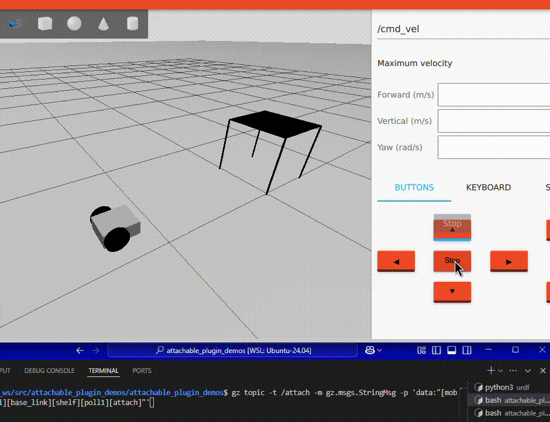
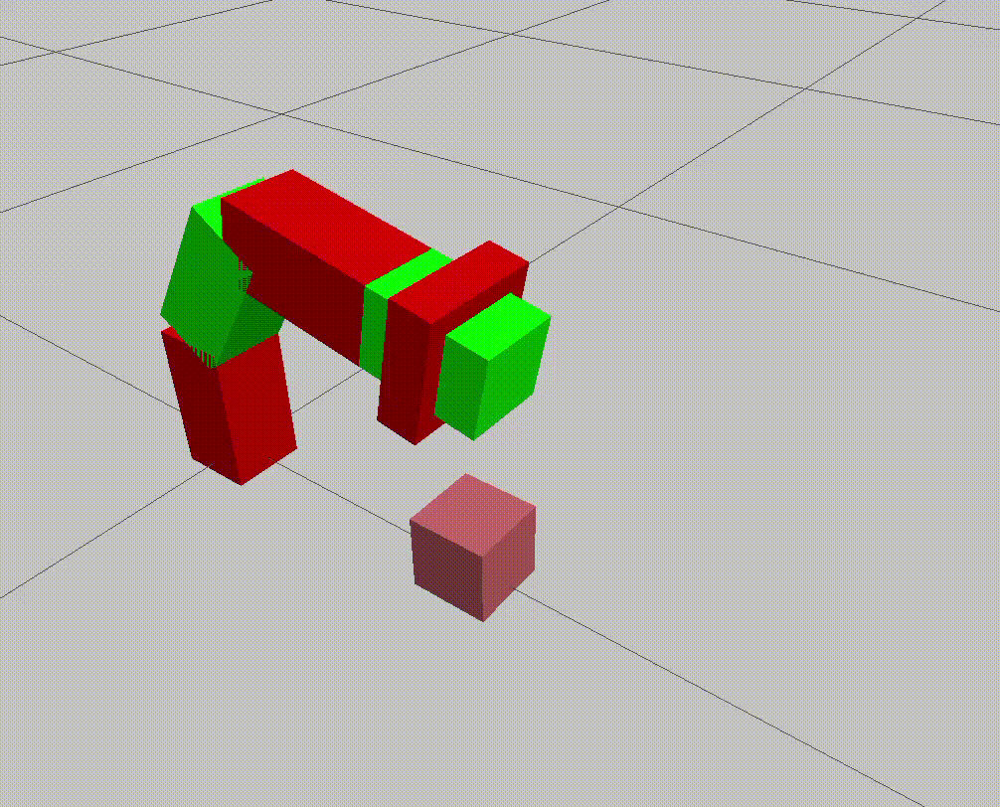
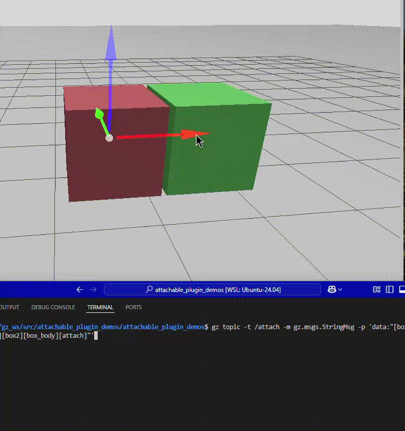

<!-- -->
# AttachablePlugin

---

**This repository is a fork of [Dagu12s/AttachablePlugin](https://github.com/Dagu12s/AttachablePlugin) with some modifications to the code.**

---

**table of contents**
- [AttachablePlugin](#attachableplugin)
  - [Tested Environment](#tested-environment)
  - [Installation](#installation)
  - [Configuration](#configuration)
  - [Simulation](#simulation)
    - [Simple Attach/Detach](#simple-attachdetach)
    - [Docking a Shelf to a Transport Robot](#docking-a-shelf-to-a-transport-robot)
    - [Vacuum Gripper (in conjunction with a contact sensor)](#vacuum-gripper-in-conjunction-with-a-contact-sensor)


[日本語のREADNEはこちら](README_jp.md)


This plugin enables dynamic attachment and detachment of joints to arbitrary models/links in the Gazebo (formerly Ignition Gazebo) environment.

Using this plugin, you can simulate scenarios such as "vacuum grippers" or "docking shelves to transport robots."





## Tested Environment

- Ubuntu 24.04
- ROS 2 Jazzy
- Gazebo Harmonic

## Installation

- First, clone this repository into your ROS 2 workspace (assuming the ROS 2 workspace is already created, and here we use `~/ros2_ws` as an example).

    ```bash
    cd ~/ros2_ws/src
    ```

    ```bash
    git clone https://github.com/akinami3/AttachablePlugin.git
    ```

- Build the workspace and source it.

    ```bash
    cd ~/ros2_ws
    ```

    ```bash
    colcon build --symlink-install
    ```

    ```bash
    source ~/ros2_ws/install/setup.bash
    ```

## Configuration

To use this plugin, add the following to your SDF file:

```xml
<?xml version="1.0" ?>
<sdf version="1.6">
  <world name="default">

    <!--Omitted-->

    <!--attachable joint plugin-->
    <plugin filename="libattachable_joint_plugin.so" name="attachable_joint::AttachableJoint">
        <attachtopic>/attach</attachtopic>
    </plugin>

    <!--Omitted-->
  </world>
</sdf>
```

## Simulation

Here, we will run the following three simulations:

- Simple attach/detach
- Docking a shelf to a transport robot
- Vacuum gripper (in conjunction with a contact sensor)

### Simple Attach/Detach

This simulation demonstrates attaching and detaching two boxes, as shown in the video below.



- Run the sample for simple attach/detach.

    ```bash
    ros2 launch attachable_plugin_demos attachable_joint_demo.launch.py
    ```

- Once Gazebo starts, try moving one of the two boxes. At this point, they should not be attached and should move independently.

- Next, publish a topic to attach them.

    ```bash
    gz topic -t /attach -m gz.msgs.StringMsg   -p 'data:"[box1][box_body][box2][box_body][attach]"' # data:"[Model name of the first object][Link name of the first object][Model name of the second object][Link name of the second object][attach or detach]"'
    ```

- After publishing the topic, the two boxes will be attached. When you move one box, the other will move along with it.

- Finally, publish a topic to detach them.

    ```bash
    gz topic -t /attach -m gz.msgs.StringMsg   -p 'data:"[box1][box_body][box2][box_body][detach]"' # data:"[Model name of the first object][Link name of the first object][Model name of the second object][Link name of the second object][attach or detach]"'
    ```

- After publishing the topic, the two boxes will be detached and will move independently as before.

### Docking a Shelf to a Transport Robot


This simulation demonstrates docking a shelf to a transport robot, as shown in the video below.

- Run the sample for docking a shelf to a transport robot.

    ```bash
    ros2 launch attachable_plugin_demos mobile_robot_demo.launch.py
    ```

- Once Gazebo starts, try moving the transport robot using teleop. At this point, it should not be attached and should move independently.

- Move the transport robot near the bottom of the shelf, then publish a topic to attach them.

    ```bash
    gz topic -t /attach -m gz.msgs.StringMsg   -p 'data:"[mobile_robot_model][base_link][shelf][poll1][attach]"'
    ```

- After publishing the topic, the transport robot and the shelf will be attached. When you move the transport robot, the shelf will move along with it.
    - (In this example, a shelf without casters is used, so the transport robot's movement may become unstable when the shelf is attached. In practice, you may need to "slightly lift the shelf just before attaching" or "use a shelf with casters.")

### Vacuum Gripper (in conjunction with a contact sensor)


This simulation demonstrates a vacuum gripper-like behavior, as shown in the video below.

- Run the sample for the vacuum gripper.

    ```bash
    ros2 launch attachable_plugin_demos arm_robot_demo.launch.py
    ```

- Next, start the following node.

    ```bash
    ros2 run attachable_plugin_demos attach_contact_link 
    ```
    This node attaches objects when they come into contact with a "link equipped with a contact sensor."
    - Gazebo's contact sensor can obtain the "model name/link name of the object in contact," which is utilized here.

- Then, start the node to control the arm joints via the keyboard.

    ```bash
    ros2 run attachable_plugin_demos arm_joint_teleop
    ```

- With the above nodes running, use the keyboard to move the arm's end link closer to a box. When the contact sensor reacts, the arm's end link and the box will be attached. You can confirm that the box moves along with the arm.

- Finally, publish a topic to detach them, and the arm's end link and the box will be detached.

    ```bash
    ros2 topic pub /detach std_msgs/Empty "{}"
    ```
