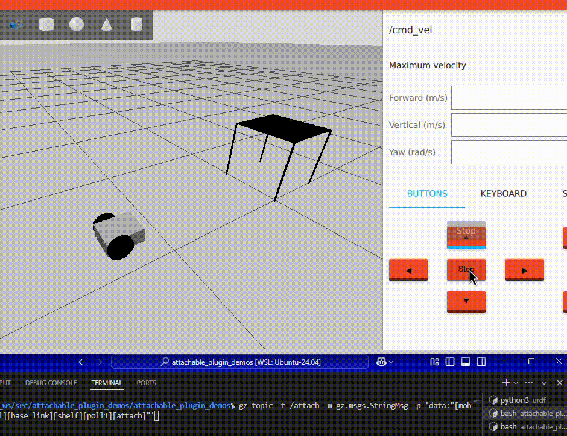
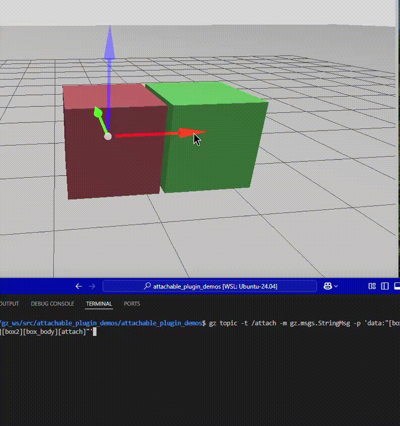

# AttachablePlugin

---

**本リポジトリは、[Dagu12s/AttachablePlugin](https://github.com/Dagu12s/AttachablePlugin)をforkし、一部コードを改変したものになります。**

---

**目次**
- [AttachablePlugin](#attachableplugin)
  - [動作確認環境](#動作確認環境)
  - [インストール](#インストール)
  - [設定](#設定)
  - [シミュレーション](#シミュレーション)
    - [シンプルなアタッチ/デタッチ](#シンプルなアタッチデタッチ)
    - [搬送ロボットへのシェルフのドッキング](#搬送ロボットへのシェルフのドッキング)
    - [バキュームグリッパー(contact sensorとの連携)](#バキュームグリッパーcontact-sensorとの連携)


本プラグインは、Gazebo (旧ignition-gazebo) の環境で、

- 任意のモデル/リンクに動的にジョイントをアタッチ、デタッチすることが可能になるプラグインです。

本プラグインを使用することで「バキュームグリッパー」や「搬送ロボットへのシェルフのドッキング」などのシミュレーションが可能になります。




## 動作確認環境

- Ubuntu 24.04
- ROS 2 Jazzy
- gazebo harmonic

## インストール

- 最初に、本リポジトリをROS2のワークスペースにクローンします（ROS2のワークスペースは作成済みの前提とし、ここでは`~/ros2_ws`とします）。

    ```bash
    cd ~/ros2_ws/src
    ```

    ```bash
    git clone https://github.com/akinami3/AttachablePlugin.git
    ```

- ワークスペースをビルドし、ソースをとおします。

    ```bash
    cd ~/ros2_ws
    ```

    ```bash
    colcon build --symlink-install
    ```

    ```bash
    source ~/ros2_ws/install/setup.bash
    ```

## 設定

本プラグインを使用する場合、SDFファイルに以下のようにプラグインを追加します。

```xml
<?xml version="1.0" ?>
<sdf version="1.6">
  <world name="default">

    <!--略-->

    <!--attachable joint plugin-->
    <plugin filename="libattachable_joint_plugin.so" name="attachable_joint::AttachableJoint">
        <attachtopic>/attach</attachtopic>
    </plugin>

    <!--略-->
  </world>
</sdf>
```


## シミュレーション

ここでは、以下の3つのシミュレーションを実行します。

- シンプルなアタッチ/デタッチ
- 搬送ロボットへのシェルフのドッキング
- バキュームグリッパー(contact sensorとの連携)


### シンプルなアタッチ/デタッチ

ここでは、下動画のような2つのボックスをアタッチ/デタッチするシミュレーションを実行します。



- シンプルなアタッチ/デタッチのサンプルを実行します。

    ```bash
    ros2 launch attachable_plugin_demos attachable_joint_demo.launch.py
    ```

- gazeboが起動したら、最初に2つのボックスの内、どちらか1つを動かしてみてください。この時点では、アタッチされておらず2つのボックスは独立して動くはずです。

- 次に、アタッチするためのトピックを発行します。

    ```bash
    gz topic -t /attach -m gz.msgs.StringMsg   -p 'data:"[box1][box_body][box2][box_body][attach]"' # data:"[1つ目のモデルのモデル名][1つ目のモデルに含まれるリンク名][2つ目のモデルのモデル名][2つ目のモデルに含まれるリンク名][attach or detach]"'
    ```

- トピックが発行されると、2つのボックスがアタッチされます。アタッチされた状態で、1つのボックスを動かすと、もう1つのボックスも一緒に動くはずです。

- 最後に、デタッチするためのトピックを発行します。

    ```bash
    gz topic -t /attach -m gz.msgs.StringMsg   -p 'data:"[box1][box_body][box2][box_body][detach]"' # data:"[1つ目のモデルのモデル名][1つ目のモデルに含まれるリンク名][2つ目のモデルのモデル名][2つ目のモデルに含まれるリンク名][attach or detach]"'
    ```

- トピックが発行されると、2つのボックスがデタッチされます。デタッチされると、最初のように2つのボックスは独立して動くはずです。


### 搬送ロボットへのシェルフのドッキング


ここでは、下動画のような搬送ロボットとシェルフをアタッチするシミュレーションを実行します。

- 搬送ロボットへのシェルフのドッキングのサンプルを実行します。

    ```bash
    ros2 launch attachable_plugin_demos mobile_robot_demo.launch.py
    ```

- gazeboが起動したら、最初に搬送ロボットをteleopで動かしてみてください。この時点では、アタッチされておらず搬送ロボットは独立して動くはずです。

- 搬送ロボットをシェルフの真下付近に移動させたら、アタッチするためのトピックを発行します。

    ```bash
    gz topic -t /attach -m gz.msgs.StringMsg   -p 'data:"[mobile_robot_model][base_link][shelf][poll1][attach]"'
    ```

- トピックが発行されると、搬送ロボットとシェルフがアタッチされます。アタッチされた状態で、搬送ロボットを動かすと、シェルフも一緒に動きます。
    - （今回は、キャスターのついていないシェルフを使用しているため、シェルフをつけた状態だと移動ロボットの動作が少し不安定になります。実際は、「アタッチする直前にシェルフを少し浮かせる」 「キャスターのついたシェルフを使用する」などの工夫が必要です。）

### バキュームグリッパー(contact sensorとの連携)


ここでは、下動画のようにバキュームグリッパーを模擬するようなシミュレーションを実行します。

- バキュームグリッパーのサンプルを実行します。

    ```bash
    ros2 launch attachable_plugin_demos arm_robot_demo.launch.py
    ```

- 次に、以下のノードを起動します。

    ```bash
    ros2 run attachable_plugin_demos attach_contact_link 
    ```
    こちらは、「"接触センサが設定されたリンク"にオブジェクトが接触したら、アタッチする」というノードになります。
    - gazeboの接触センサは「接触したオブジェクトのモデル名/リンク名」を取得できるため、それを利用しています。

- 次に、アームの各関節をキーボードで制御するノードを起動します。

    ```bash
    ros2 run attachable_plugin_demos arm_joint_teleop
    ```

- 上記のノードを起動した状態で、キーボードを使って、アームの先端のリンクをボックスに近づけてください。接触センサが反応すると、アームの先端のリンクとボックスがアタッチされます。アタッチされた状態で、アームを動かすと、ボックスも一緒に動くことが確認できます。

- 最後に、デタッチするためのトピックを発行すると、アームの先端のリンクとボックスがデタッチされます

    ```bash
    ros2 topic pub /detach std_msgs/Empty "{}"
    ```